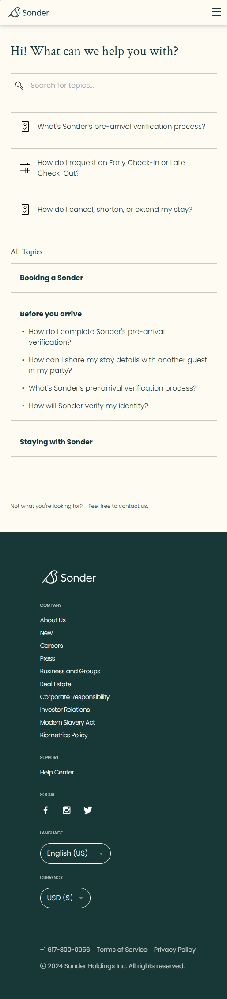
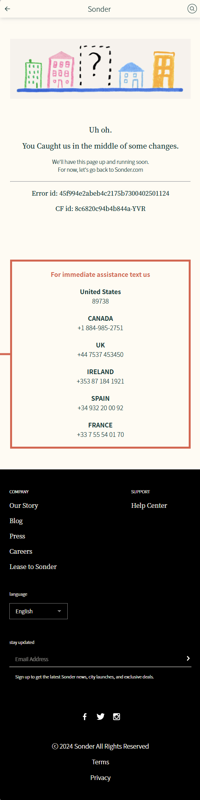

# Sonder - Clone Coding

Clone coding for Frontend

## Overview

This project is a frontend clone of the original site "Sonder." It features a responsive design and a user-friendly interface, closely mirroring the functionality and aesthetics of the original site. Users can explore the demo to see how the application performs in a real-world scenario.

## Click Demo

[Live Demo] (https://jin2nim.github.io/Sonder-clone-front)

## Mobile-Screenshots





## Key Features

- Responsive design
- User-friendly 404 page
- UI/UX based on the original site

## Get Started

### Installation

_Below is an example of how to clone and set up this project locally. This template does not require any external dependencies or services. If you would like to suggest modifications or improvements, please create a new branch and submit your changes._

1. Clone the repo:
   ```bash
   git clone https://github.com/jin2nim/Sonder-clone-front.git
   ```

## License

This project is a clone of **Sonder**, based on the design and functionality of the original site. The copyright and trademark rights of the original site are owned by its creators.

## Copyright

ⓒ 2024 Sonder. All rights reserved.

## Contact

- NAME : HYEJIN LEEM
- EMAIL : jin2nim@gmail.com
